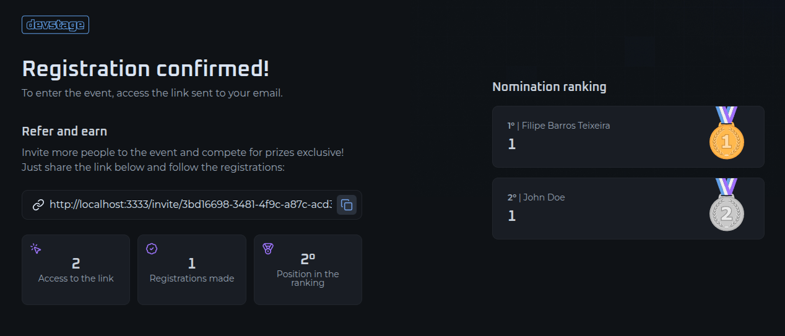

<p align="center" >
  
</p>

<p align="center">
  
  
  
  
  
  
  
</p>

<p align="center">
  <a href="#-technologies">Technologies</a>&nbsp;&nbsp;&nbsp;|&nbsp;&nbsp;&nbsp;
  <a href="#-project">Project</a>&nbsp;&nbsp;&nbsp;|&nbsp;&nbsp;&nbsp;
  <a href="#-layout">Layout</a>&nbsp;&nbsp;&nbsp;|&nbsp;&nbsp;&nbsp;
  <a href="#-license">License</a>
</p>

<p align="center">
  
</p>

<p align="center">
  
</p>

## 🚀 Technologies

This project was developed with the following technologies:

- **React**
- **Next.js**
- **TypeScript**
- **React Hook Form**
- **Tailwind CSS**
- **Lucide Icons**
- **Orval**
- **Zod**
- **Biome.js**

## 🚧 Project

DevStage is a high-performance, full-stack web application engineered to streamline the complexities of event management. It bridges the gap between simple registration and strategic growth through its integrated referral ecosystem.

Whether you are hosting a developer conference, a local workshop, or a massive webinar, DevStage provides the digital infrastructure to handle high-traffic registrations.

## 🧰 Prerequisites

- Node.js (version 18 or later)
- `npm` or `yarn`

> [!IMPORTANT]
> Do not forget to run the back-end server. The application requires an active API connection to initialize correctly.

## 💻 How to run

```bash
# Clone the repository
git clone https://github.com/filipebteixeira98/indication-web.git

# Access the project folder
cd indication-web

# Install the dependencies
npm install

# Start the local development server with hot-reloading
npm run dev
```

## 🫶 Contributing

Contributions are welcome! Please feel free to submit a Pull Request.

## 📝 License

This project is under the MIT license.

<p align="center">
  Made with ♥ by me
</p>
